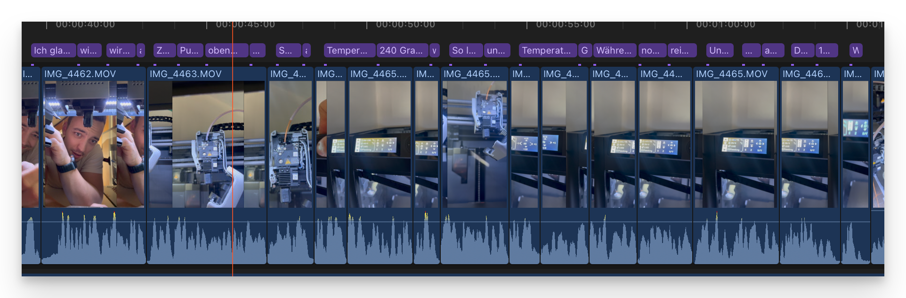

# Final Cut Pro - Easy Captions for Shorts and Reels



> Automatically generate Final Cut Pro captions from any audio file using a local Whisper model.

---

## What it does

The existing FCP capabilities for subtitles are laughable, and existing plugins are tied to subscriptions.
I don't want that, so I built my own solution and wanted to share it for free.

It transcribes your audio with [OpenAI Whisper](https://github.com/openai/whisper) and exports a ready-to-import `.fcpxml` file containing styled title overlays — one per caption group — perfectly timed to your speech.

No cloud. No subscriptions. Works offline on your device.

---

## Features

- **Local transcription** via Whisper (tiny → large models)
- **Auto-detects** installed models or downloads the one you pick
- **Language selection** — auto-detect or specify manually (de, en, fr, …)
- **Configurable captions** — max words per caption, font, font size, font face
- **Any resolution** — set width × height freely in `style.json` (portrait, landscape, custom)
- **Persistent settings** — your last choices become the new defaults
- **`style.json`** for fine-grained visual control: resolution, text color, stroke, drop shadow
- **Zero manual setup** — a virtual environment is created and managed automatically

---

## Requirements

- Python 3.8+
- macOS (tested), should work on Linux

No manual `pip install` needed — the script handles everything on first run.

---

## Usage

Export your audio first — any format works (`.m4a`, `.wav`, `.mp3`, …).

```bash
python3 fcp_captions.py path/to/audio.m4a
```

The script walks you through model selection, language, and caption settings interactively. Your choices are saved for the next run.

### CLI flags (optional)

| Flag | Description |
|------|-------------|
| `-m MODEL` | Whisper model name or path |
| `-l LANG` | Language code (`de`, `en`, `auto`, …) |
| `-w N` | Max words per caption |
| `-s N` | Font size |
| `-f FONT` | Font name |
| `--font-face FACE` | `Regular` or `Bold` |
| `-o FILE` | Output path for the `.fcpxml` file |

---

## Style configuration

Edit `style.json` to control the visual appearance and resolution of your captions:

```json
{
  "font_color": "1.0 1.0 1.0 1.0",
  "position_y": 0,
  "resolution": {
    "width": 1080,
    "height": 1920
  },
  "stroke": {
    "enabled": false,
    "color": "0.0 0.0 0.0",
    "opacity": 1.0,
    "width": 2
  },
  "shadow": {
    "enabled": true,
    "color": "0.0 0.0 0.0",
    "opacity": 0.75,
    "distance": 4,
    "angle": 315
  }
}
```

See [`style.md`](style.md) for a full reference of every field.

---

## Importing into Final Cut Pro

1. Run the script → a `.fcpxml` file is created next to your audio file
2. In FCP: **File → Import → XML…**
3. The captions appear in a new event called **Auto generated Captions**
4. Copy the title clips into your timeline and adjust as needed

---

## Whisper model sizes

| Model | Size | Speed | Accuracy |
|-------|------|-------|----------|
| tiny | ~75 MB | fastest | basic |
| base | ~145 MB | fast | good |
| small | ~466 MB | moderate | better |
| medium | ~1.5 GB | slow | great |
| large | ~3 GB | slowest | best |

`small` is a solid default for most use cases.

---

## License

MIT
